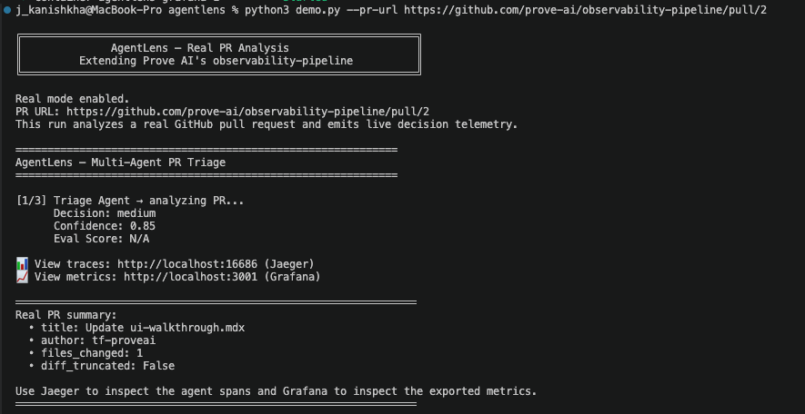
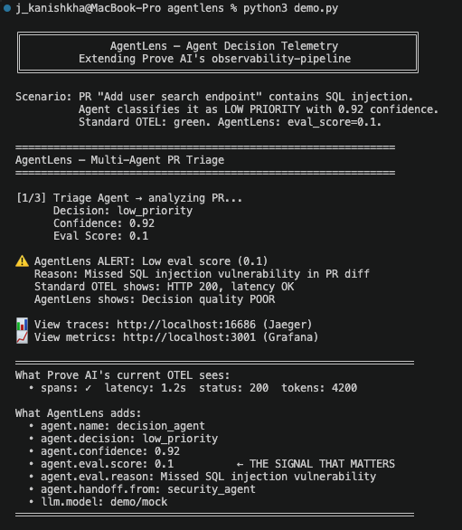
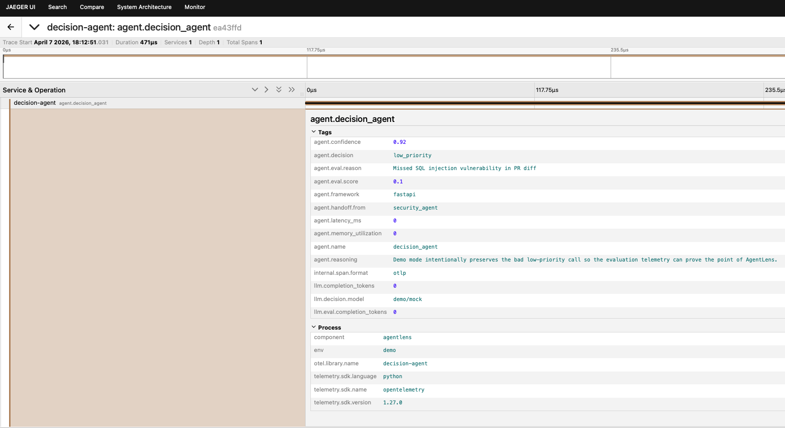
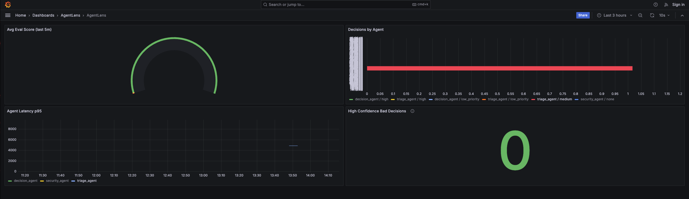

# AgentLens

    

**AgentLens makes AI agent decision quality visible in your observability stack.**

---

A PR comes in. The agent says "low_priority" with 0.92 confidence. Standard observability shows HTTP 200, 1.2s latency, 4200 tokens. The dashboard is green. But the PR contains a SQL injection vulnerability.

AgentLens shows `agent.eval.score=0.1` and `agent.eval.reason="Missed SQL injection vulnerability"`.

This is the gap: the dashboard is green but the system is broken.

---

## The Gap

Prove AI's `observability-pipeline` comes with 2 OTEL span dimensions:

```diff
 dimensions:
   - name: env
   - name: component
```

That's enough for LLM inference. For multi-agent systems it's blind to decision quality.

AgentLens adds 7 more:

```diff
 dimensions:
   - name: env
   - name: component
+  - name: agent.name
+  - name: agent.decision
+  - name: agent.framework
+  - name: agent.handoff.from
+  - name: llm.model
+  - name: agent.eval.score
+  - name: agent.eval.reason
```

Total: **9 dimensions** instead of 2.

---

## Architecture

```
GitHub PR ─────► MCP Server ─────► Triage Agent ───► Security Agent ──► Decision Agent
                       │                   │                   │                   │
                       │                   │                   │                   │
                       ▼                   ▼                   ▼                   ▼
                  OTEL SPANS FLOWING TO:
                       │                   │                   │                   │
                       └───────────────────┴───────────────────┴───────────────────┘
                                             │
                                             ▼
                                     OTEL Collector
                                             │
                              ┌──────────────┼──────────────┐
                              │              │              │
                              ▼              ▼              ▼
                         Prometheus   VictoriaMetrics    Jaeger
                            │              │              │
                            ▼              ▼              ▼
                          Grafana      (storage)      (traces)
```

---

## Custom Span Attributes

| Attribute | Type | Example | What It Means |
|-----------|------|---------|----------------|
| `agent.name` | string | `decision_agent` | Which agent made the decision |
| `agent.decision` | string | `low_priority` | The output decision |
| `agent.confidence` | float | `0.92` | How confident the agent was (0-1) |
| `agent.eval.score` | float | `0.1` | LLM-as-judge quality score (0-1) |
| `agent.eval.reason` | string | `Missed SQL injection` | Why the judge gave that score |
| `agent.framework` | string | `fastapi` | The agent's runtime |
| `agent.handoff.from` | string | `security_agent` | Which agent passed context |
| `llm.model` | string | `gpt-4o-mini` | Model used |

---

## Demo Scenario

A GitHub PR contains SQL injection:

```python
result = conn.execute(f"SELECT * FROM users WHERE name = '{query}'")
```

### What Standard OTEL Sees

```
status: 200
latency: 1.2s
tokens: 4200
─────────────────────────────────
Dashboard: GREEN ✓
```

### What AgentLens Sees

```
agent.name: decision_agent
agent.decision: low_priority
agent.confidence: 0.92
agent.eval.score: 0.1              ← THE SIGNAL
agent.eval.reason: Missed SQL injection
─────────────────────────────────
Dashboard: RED ✗
```

---

## Quick Start

```bash
cp .env.example .env
# Add OPENAI_API_KEY to .env
docker compose up -d
sleep 20
python demo.py
```

---

## What You'll See

| Service | URL | Credentials |
|--------|-----|-------------|
| Jaeger | http://localhost:16686 | — |
| Grafana | http://localhost:3001 | admin / agentlens |
| Prometheus | http://localhost:9090 | — |

### Jaeger Trace Views

**Triage Agent** — classifies PR priority:


**Security Agent** — scans for vulnerabilities:


**Decision Agent** — final verdict + eval score:


### Grafana Dashboard



---

## Tech Stack

| Layer | Technology | Role |
|-------|------------|------|
| Agents | Python 3.11 + FastAPI | HTTP-first agent services |
| LLM calls | LiteLLM | Model routing |
| Tool access | MCP server | GitHub PR fetching |
| Tracing | OpenTelemetry SDK | Span generation |
| Export | OTLP gRPC | Span/metric export |
| Collector | OTel Collector | Pipeline |
| Time series | Prometheus | Metrics scrape |
| Storage | VictoriaMetrics | Long-term metrics |
| Trace UI | Jaeger | Trace inspection |
| Dashboards | Grafana | Visualization |

---

## Why Framework-Agnostic

1. **Transparency** — every span attribute is explicit
2. **Hackable** — agents are just FastAPI services
3. **Transport** — observability layer outlives frameworks

---

## Roadmap

Detection → Diagnosis → Correction

AgentLens moves observability from "did it run?" to "was it right?"

---

## Repo Structure

```
agentlens/
├── agents/
│   ├── triage_agent.py
│   ├── security_agent.py
│   └── decision_agent.py
├── mcp_server/
│   └── github_mcp.py
├── demo.py
├── orchestrator.py
├── otel_instrumentor.py
├── docker-compose.yml
└── tests/
```